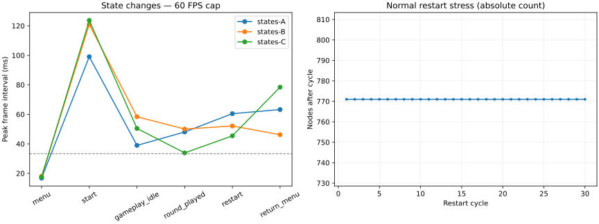

# Audit des performances de Pile Down

Audit du 20 septembre 2026 sur l’état de travail local, après la passe fonctionnelle. **La passe initiale était un diagnostic sans modification du code de production. Les corrections validées ensuite sont consignées ci-dessous ; les mesures initiales sont conservées comme baseline.** Les scénarios et l’instrumentation ajoutés restent dans `tests/performance/` ; le rapport fonctionnel reste distinct.

| ID | Sévérité | Type | Résumé | Configuration | Mesure | Statut |
|---|---|---|---|---|---|---|
| PERF-001 | Medium | Stutter | Pics au démarrage et aux transitions de partie | Windows / Compatibility / 512×640 / limite 60 FPS | Démarrage corrigé : ~17 ms ; retour menu encore 34–37 ms, 71 ms dans une trace supplémentaire | Démarrage/restart corrigés ; retour menu ouvert |
| PERF-002 | Low | CPU / allocations | Reconstruction des poids de déformation à chaque frame | Gameplay, même lorsque les cartes sont immobiles | Conteneurs et deux tableaux d’uniforms recréés à chaque appel ; microbenchmark ci-dessous | Optimisé et revalidé — coût médian réduit de 64 % |
| PERF-003 | Medium | Frametime / affichage | Ralentissement pendant le redimensionnement continu | Windows / Compatibility / 180 tailles imposées, 3 essais | Dernière comparaison : médiane 56,54 → 58,02 FPS ; P95 23,87 → 22,50 ms | Recalculs regroupés ; gain modeste, pics ouverts |
| MEM-001 | Medium | Accumulation / draw calls | Une transition de fond interrompue laisse des couches attachées | Windows / Compatibility / 30 transitions espacées de 50 ms | 1 → 30 couches ; 16 → 45 draw calls ; 3/3 | Corrigé et revalidé — 3/3 essais |
| MEM-002 | Low | Libération des ressources | Deux textures signalées non libérées à l’arrêt | Trois renderers, runtime de développement | 2 RID ; 7 696 octets annoncés en Compatibility à 512×640 | Corrigé et revalidé — trois renderers |

## Suivi des corrections — 20 septembre 2026

MEM-001 et MEM-002 sont corrigés et revalidés ; leurs sections détaillent le changement et les preuves avant/après. Les tableaux de mesures de la passe initiale ci-dessous sont conservés sans recalcul. Les six mesures avec rendu réel de la première passe de correction sont isolées dans `tests/performance/fixes/` pour ne pas modifier cette baseline. PERF-002 a ensuite été optimisé (voir sa revalidation ci-dessous). PERF-003 a été amélioré partiellement par la garde du curseur, avec comparaison avant/après ci-dessous. PERF-001 et PERF-003 restent ouverts : les pics de frametime ne sont pas résolus.

Les [contrôles Godot](../../../tests/performance/fixes/validation.json) passent : import headless (`--editor --quit`), démarrage headless (`--quit-after 240`), démarrage avec rendu sans sonde (`--quit-after 120`) et cycle de vie du curseur avec rendu. Aucun diagnostic de fuite, de parsing, de ressource manquante ou d’exécution ; seul le message environnemental du magasin de certificats est exclu du bilan. Les [cinq tests de régression](../../../tests/performance/fixes/regression-tests.json) couvrent les transitions interrompues, les thèmes, le curseur, le fond adaptatif et la grille True Pixel Art.

## Suite de l’audit — 21 septembre 2026

**Douze nouveaux processus avec rendu réel, tous terminés et conformes aux observations attendues**, soit environ **2 min 54 s** d’exécution cumulée. Cette passe affine PERF-001 et PERF-003 sans modifier le code de production. Les résultats historiques restent inchangés ; les nouvelles [traces et matrices](../../../tests/performance/continuation-2026-09-21/) et leur [synthèse vérifiée](../../../tests/performance/continuation-2026-09-21/summary.json) sont séparées.

Même binaire Godot 4.7.2, Compatibility, VSync désactivée, plafond 60 FPS, profils isolés. Le jeu est explicitement en semi_adaptive, True Pixel Art désactivé. `DebugSettings.ENABLED` vaut **false** dans cette passe et est enregistré dans les métadonnées : les configurations de debug locales peuvent changer entre deux audits. L’état de travail a également évolué depuis le 20 septembre. Les écarts avec la baseline ne constituent donc **pas** une mesure avant/après d’un nouveau correctif.

### PERF-003 : comparaison à une scène minimale

Trois essais par variante, en alternant l’ordre des variantes entre les paires. Chaque processus applique les mêmes **180 demandes de taille**, de 512×640 à 1456×952 selon les rampes historiques ; les 180 tailles retournées sont vérifiées. Une seconde à taille fixe précède et suit la séquence. La scène minimale contient seulement la fenêtre racine et un `ColorRect`, avec le même étirement CANVAS_ITEMS / EXPAND et une base 256×320. Elle utilise la même sonde, qui précharge toujours les ressources de Main sans l’instancier : c’est un contrôle du coût d’exécution/rendu, **pas** un contrôle du chargement ou de la mémoire minimale du moteur.

| Variante, trois essais | FPS moyens | P95 ms | Pire intervalle ms | GPU médian ms | Nodes / draw calls médians |
|---|---|---|---|---|---|
| Fenêtre + ColorRect | 60,03–60,06 | 16,73–16,75 | 17,84 | 0,145–0,153 | 2 / 1 |
| Jeu complet, plateau initial | 55,27–57,21 | 21,60–26,64 | 35,51 | 0,981–1,049 | 771 / 16 |

La fenêtre minimale tient le plafond dans les trois essais, tandis que le jeu présente un surcoût pendant le resize. Cela **ne permet pas** d’attribuer tout l’écart aux scripts : complexité de rendu, recalculs différés, pilote et synchronisation diffèrent aussi entre les variantes. La mesure synchrone de l’affectation `root.size` coûte déjà **5,11–6,04 ms en médiane** dans la scène minimale, contre **6,54–6,84 ms** dans le jeu. Ces durées incluent les opérations synchrones déclenchées par le setter et ne mesurent pas exclusivement Windows. Les variantes sont plafonnées : leur écart de FPS ne donne pas directement le coût CPU marginal.

Trois processus diagnostiques supplémentaires remplacent temporairement les deux connexions vers `_resize_dust_distribution()` par un wrapper chronométré. Ils sont conservés séparément, car le remplacement modifie l’ordre des callbacks. Résultat identique dans les trois essais : **232 appels** pour 180 demandes, dont **179 notifications viewport et 53 notifications item_rect**. La première taille demandée est déjà la taille courante. Coût médian d’un appel : **0,517–0,588 ms** ; maximum par essai : **1,376–1,944 ms**. Le total des appels de profondeur zéro est de **129,43–143,96 ms**, soit **0,72–0,80 ms par demande** en moyenne. Les appels imbriqués ne sont pas additionnés une seconde fois.

Le wrapper couvre le layout synchrone et la programmation des mises à jour, **pas l’exécution différée** de `DustPool.resize_to_viewport()`, des fonds ou de la déformation. Les 53 notifications supplémentaires rendent le regroupement des mises à jour intéressant à évaluer, mais ne prouvent pas qu’elles sont toutes redondantes : les dimensions peuvent évoluer pendant la stabilisation du layout. Aucun regroupement n’est appliqué sans mesure des callbacks différés et validation visuelle des modes d’affichage.

**Conclusion : PERF-003 reste ouvert.** Le surcoût propre au jeu est reproduit face au contrôle minimal. Priorité suivante : chronométrer les mises à jour différées de poussières/fonds et la stabilisation des conteneurs, puis comparer une éventuelle coalescence sur cette même matrice. Les essais ne couvrent toujours ni le drag physique de fenêtre ni un export Release.

### PERF-001 : séparer l’appel initial des frames suivantes

Trois processus supplémentaires, seeds PERF-A/B/C, chronomètrent directement le retour de `game.start_game()` et conservent les intervalles des frames jusqu’à l’état jouable. L’animation de sortie du menu reste active. Les logs sont émis après la phase mesurée pour le nouveau chronométrage.

| Seed | Appel synchrone `start_game` ms | Pic de la phase start ms | Second intervalle >33 ms | P95 start ms |
|---|---|---|---|---|
| PERF-A | 1,515 | 84,265 | 39,933 | 16,700 |
| PERF-B | 1,391 | 78,075 | 38,352 | 16,691 |
| PERF-C | 1,652 | 78,803 | 39,721 | 16,695 |

Les trois essais présentent deux intervalles supérieurs à 33,333 ms : le premier intervalle enregistré, puis l’intervalle d’indice 34 ou 35. Le gros du pic initial ne se trouve donc pas dans le bloc synchrone de `start_game()` sur ce parcours avec sortie animée du menu. Le `start_round()` appelé après le tween, les traitements différés, la préparation du rendu et les synchronisations restent à attribuer. Cela n’exclut pas un chargement audio dans un autre parcours, notamment un changement de section ; aucune compilation de shader n’est démontrée par ces seules traces.

**Conclusion : PERF-001 reste ouvert, attribution affinée.** Prochaine mesure : trace des callbacks différés et du premier rendu autour de ces deux intervalles. Précharger davantage de ressources ou réécrire l’audio sur la seule base du pic initial n’est pas justifié par cette passe.

### Reproduction de cette passe

Exécuter successivement, sans autres benchmarks en parallèle :

```powershell
python tests/performance/run_benchmarks.py --godot 'H:\Programmes\Dev\Godot\4.7.2\Godot_v4.7.2.exe' --matrix tests/performance/continuation-2026-09-21/resize-matrix.json --output tests/performance/continuation-2026-09-21/resize --timeout 90
python tests/performance/run_benchmarks.py --godot 'H:\Programmes\Dev\Godot\4.7.2\Godot_v4.7.2.exe' --matrix tests/performance/continuation-2026-09-21/resize-trace-matrix.json --output tests/performance/continuation-2026-09-21/resize-trace --timeout 90
python tests/performance/run_benchmarks.py --godot 'H:\Programmes\Dev\Godot\4.7.2\Godot_v4.7.2.exe' --matrix tests/performance/continuation-2026-09-21/start-matrix.json --output tests/performance/continuation-2026-09-21/start --timeout 90
python tests/performance/continuation-2026-09-21/summarize_continuation.py
```

Le script de synthèse vérifie les codes de sortie, timeouts, fin de scénario, observations attendues et tailles demandées/réelles. Il conserve les empreintes SHA-256 des principaux fichiers de l’état de travail au moment de la synthèse. Les logs bruts incluent toujours l’erreur environnementale du magasin de certificats Windows, seule erreur exclue du bilan ; aucune erreur de script n’apparaît dans ces douze processus.

Validation de la sonde modifiée : [import éditeur et démarrage de 240 frames](../../../tests/performance/continuation-2026-09-21/validation.json) terminés avec code 0, sans erreur de parsing, de ressource ou d’exécution. Les scripts Python du runner et de la synthèse passent `py_compile`. Les journaux complets sont conservés à côté du bilan.

## Corrections supplémentaires — 21 septembre 2026

Corrections appliquées et comparées, preuves dans [fixes/remaining](../../../tests/performance/fixes/remaining/). La trace `frame_pre_draw` → `frame_post_draw` localise les deux pauses initiales de PERF-001 dans le rendu : **81,063 ms puis 38,735 ms** ([trace](../../../tests/performance/fixes/remaining/trace/trace-start-d2db332d.json)). Il ne s’agit pas d’un profilage individuel des appels GPU ni d’une preuve directe de compilation de chaque shader.

### PERF-001 — premier rendu préparé avant la partie

**Correction appliquée et démarrage revalidé sur trois seeds.** `RenderWarmup.gd` dessine une fois les matériaux du gameplay, des tuiles et des fonds dans un viewport temporaire de 64×64, jamais affiché, puis le libère. Les copies de cartes/piles servent uniquement à récupérer leurs matériaux : elles n’entrent pas dans l’arbre et leur gameplay ne démarre pas. Aucun tirage RNG ni paramètre des matériaux existants n’est modifié. Cette préparation est ignorée en headless.

La première version trop large est **écartée** : elle augmentait le boot d’environ 2,5 s. La version retenue limite les matériaux préparés et respecte leurs masques de lumière. Comparaison rapprochée avant/après, trois seeds PERF-A/B/C :

| Mesure | Avant | Après préparation ciblée + regroupement resize |
|---|---|---|
| Pic start, plage | 78,078–84,187 ms | **16,712–16,722 ms** |
| Intervalles start >33,333 ms, par essai | 2 | **0** |
| Durée boot mesurée, médiane | 0,405 s | **1,426 s** |

**Compromis explicite : environ 1,02 s supplémentaire au boot mesuré.** Le travail est anticipé au chargement, pas supprimé ; le temps total jusqu’au menu augmente. Ce boot commence après les préchargements de la sonde et n’est pas un temps de lancement d’export Release. Les caches pilote ne sont pas purgés. La préparation des matériaux inutilisés au premier round contribue aussi à ce coût, en échange d’une préparation des fonds suivants.

Le premier parcours complet corrigé reste fluide au démarrage et au changement de fond, mais un intervalle de retour menu atteint 38,15 ms. Un second parcours instrumenté localise encore 38,71 ms dans le rendu au restart. La préparation du matériau du masque de replay a donc été ajoutée. Les **trois parcours complets finaux** PERF-A/B/C, avec cette préparation supplémentaire, donnent :

| Phase | Plage des pics entre les trois seeds |
|---|---|
| Start | **16,799–17,056 ms** |
| Changement de tier/fond injecté | **16,719–16,812 ms** |
| Restart | **16,716–16,881 ms** |
| Retour menu | **34,418–36,981 ms** |

Le boot de ces trois parcours est de **1,356–1,560 s**. [Traces finales](../../../tests/performance/fixes/remaining/validated-states/) ; [matrice reproductible](../../../tests/performance/fixes/remaining/states-matrix.json).

**PERF-001 reste partiellement ouvert pour le retour menu.** Une [trace supplémentaire](../../../tests/performance/fixes/remaining/return-trace/states-trace-3c470ee8.json) mesure un retour initial synchrone de **62,914 ms** et un pic de phase de **70,542 ms**. Ce résultat plus lent est conservé, sans l’écarter de l’analyse. Le chemin initial déplace le sous-arbre Splash dans son CanvasLayer de transition et prépare sa disposition avant le premier `await` ; l’attribution entre ces opérations reste à mesurer. Préparer davantage de shaders ne traiterait pas ce coût synchrone. La correction conservée ne modifie pas cette animation ni la hiérarchie des menus.

Une tentative de thème explicite sur Splash, pour éviter les changements d’héritage au déplacement, a été **rejetée puis retirée** : [essai](../../../tests/performance/fixes/remaining/menu-theme-trial/states-trace-c420671d.json), appel synchrone 37,146 ms et pic 47,609 ms, sans gain établi face aux trois parcours à 34–37 ms. Aucun correctif du retour menu n’est revendiqué.

### PERF-003 — notifications regroupées et poussières conservées

**Correction appliquée, gain limité mesuré.** Les notifications viewport/conteneur programment désormais un seul passage différé de layout et de mise à jour des effets. Ce passage utilise les dimensions les plus récentes ; les notifications synchrones qu’il émet ne le reprogramment pas. `DustPool.resize_to_viewport()` conserve particules et vagues si les dimensions et l’effectif n’ont pas changé ; `setup()` continue à forcer une reconstruction explicite pour les changements de réglages.

| Mesure, trois essais de 180 tailles | Avant | Après |
|---|---|---|
| FPS moyens, plage | 55,98–57,34 | 57,37–58,40 |
| Médiane FPS moyens | 56,54 | **58,02 (+2,6 %)** |
| Médiane P95 | 23,869 ms | **22,502 ms (−5,7 %)** |
| Pire intervalle | 35,482 ms | **42,286 ms** |

Le gain de débit est modeste et **les pics ne sont pas résolus** ; le pire intervalle augmente. L’essai intermédiaire regroupant seulement les effets, sans différer le layout, variait de 54,31 à 60,00 FPS : cette dispersion souligne la limite d’une petite série sur un système non verrouillé. La préparation des matériaux est également présente dans la version après ; aucun gain global n’est attribué exclusivement à une ligne du gestionnaire. **PERF-003 reste ouvert pour le coût résiduel de resize moteur/pilote et les recalculs restants.**

Les tests de coalescence vérifient que 50 notifications identiques produisent une seule mise à jour et que les dernières dimensions sont appliquées après plusieurs demandes. Les tests de poussières vérifient la conservation des vagues, le changement d’effectif et la reconstruction explicite. Les tests True Pixel Art, semi_adaptive et joker passent. Un ancien test des options attend encore des constantes de marge 16/12/16/16 alors que `GameScreenLayout.apply_screen_margin_control()` les remplace par zéro et applique les marges via les offsets ; cet échec préexistant n’est pas présenté comme une validation réussie.

Preuves : [synthèse avant/après](../../../tests/performance/fixes/remaining/summary.json), [matrice](../../../tests/performance/fixes/remaining/final-matrix.json), [tests principaux](../../../tests/performance/fixes/remaining/tests.json), [tests coalescence et warmup corrigé](../../../tests/performance/fixes/remaining/coalescing-tests.json). Les expériences intermédiaires et les deux processus contenant une erreur de typage transitoire de la sonde sont conservés, mais exclus des comparaisons. Le premier test du warmup contenait également une erreur de typage corrigée avant sa relance réussie.

Validation finale : [8/8 contrôles](../../../tests/performance/fixes/remaining/validation.json) passent — import éditeur et démarrage headless de 240 frames, puis test du cycle de vie du viewport temporaire et démarrage réel de 120 frames sur **Compatibility, Mobile et Forward+**. Aucun diagnostic de fuite RID, de parsing ou d’exécution ; seul le magasin de certificats Windows reste inaccessible. Le test détruit aussi l’hôte avant la fin du rendu pour vérifier le nettoyage interrompu. Cela valide le cycle de vie sur les trois renderers, **pas** un gain de performance chiffré sur Mobile/Forward+ ni un export Release.

Reproduction des mesures retenues : relancer `run_benchmarks.py` avec `--matrix tests/performance/fixes/remaining/final-matrix.json`, puis avec `--matrix tests/performance/fixes/remaining/states-matrix.json`, dans deux dossiers de sortie neufs et successivement. `python tests/performance/fixes/remaining/summarize_fixes.py` reconstruit la synthèse des dossiers archivés. Les instantanés avant correction des trois scripts modifiés sont conservés dans `source-before/` ; le nouveau script de préparation du rendu n’existait pas dans la version avant.

## Baseline et environnement

- Godot **4.7.2 stable**, binaire `H:\Programmes\Dev\Godot\4.7.2\Godot_v4.7.2.exe`, hash `ed1daf0bf001b61586d9930840f2f1394092c079`.
- Windows, **Intel Core i7-4770K @ 3,50 GHz**, 8 processeurs logiques ; **NVIDIA GeForce RTX 2070 SUPER**. Le journal OpenGL annonce le pilote **576.80**. Les informations proviennent du moteur ; les requêtes WMI sont refusées dans l’environnement.
- Le renderer réellement configuré dans `project.godot` est **Compatibility** (`gl_compatibility`). La métadonnée `config/features` mentionne Forward Plus, ce qui ne suffit pas à identifier le renderer exécuté. Les autres essais utilisent **Mobile/D3D12** et **Forward+/D3D12** ; les logs attestent leur démarrage effectif.
- Scène principale `resources/scenes/Main.tscn` contenant `Game.tscn`. Menu, gameplay, choix et fin sont des couches de la même scène. Restart et retour menu ne rechargent pas une nouvelle scène complète. Aucun autoload déclaré.
- Taille logique de base 256×320, fenêtre 512×640. Filtrage nearest, coordonnées 2D alignées sur les pixels. L’option True Pixel Art peut faire rendre un viewport réduit puis l’agrandir : **taille de fenêtre et résolution interne ne sont pas interchangeables**. Les tailles réellement retournées par le moteur figurent dans chaque `PERF_META`.
- Présence d’un `BackBufferCopy`, d’un fond animé et d’un post-traitement de déformation. Les transitions de fond superposent normalement deux couches pendant 0,95 s. Les particules de poussière sont simulées par script et dessinées par un Control, pas par un système de particules GPU.
- Exports déclarés : Web, Linux, Windows, Android. Le preset Windows intègre le PCK, définit `script_export_mode=2` et désactive le shader baker. Les presets excluent `tests/*`. Les templates installés inspectés sont en **4.4.1**, pas en 4.7.2 : aucune comparaison d’exports Debug/Release n’est revendiquée.
- Exécution avec le binaire de développement hors interface de l’éditeur ; ce n’est ni un export Release, ni une mesure de F6 avec l’éditeur et son profiler ouverts.

## Méthode et interprétation

Les benchmarks sont **sériels**, avec un nouveau processus et un profil `APPDATA`/XDG sous `.godot/audit-profiles/` par essai. Aucun accès aux sauvegardes du joueur. Les caches d’import et de shaders du projet et du pilote ne sont pas purgés : « premier affichage » signifie premier usage dans le processus, **pas un démarrage garanti à cache froid**. La charge des autres applications et les fréquences CPU/GPU ne sont pas verrouillées.

Les intervalles sont mesurés avec `Time.get_ticks_usec()` à chaque `_process`, sans `--fixed-fps`. FPS moyen = nombre d’intervalles / durée ; FPS minimum = inverse du plus grand intervalle, et non un minimum glissant sur une seconde. Les percentiles et le nombre d’intervalles dépassant 33,333 ms sont conservés. Les limites de phases peuvent tronquer le premier intervalle ; les moyennes très proches de 60 peuvent donc dépasser légèrement 60. Les pics des phases de gameplay initial incluent parfois la fin de l’entrée des cartes.

Les compteurs du moteur sont échantillonnés toutes les 250 ms, plus aux limites de phase. `render_gpu_ms` et `render_cpu_ms` concernent le **viewport racine** ; le second ne représente pas tout le CPU du jeu. La mesure de rendu est explicitement activée. Les valeurs brutes de `TIME_PROCESS` sont conservées, sans être présentées comme une mesure du coût des scripts. Voir les définitions de [RenderingServer](https://docs.godotengine.org/en/stable/classes/class_renderingserver.html#class-renderingserver-method-viewport-get-measured-render-time-cpu) et de [Performance](https://docs.godotengine.org/en/stable/classes/class_performance.html).

Le runner mesure aussi le working set (RSS), les octets privés et le temps CPU du processus via les API Windows. Le pourcentage CPU agrégé prend **100 % pour un cœur logique** et comprend le lancement et les transitions ; diviser par huit pour une fraction de la capacité logique totale. Ce n’est pas le CPU d’une frame donnée. La mémoire statique Godot, le RSS, les octets privés et les octets vidéo suivis par le moteur sont des métriques distinctes ; ces derniers ne sont pas une mesure exhaustive de la VRAM résidente du pilote.

L’instrumentation conserve des intervalles et des dictionnaires : elle consomme un peu de CPU et de mémoire. Les traces sont vidées entre phases, les fichiers sont écrits hors intervalle mesuré et la fréquence des compteurs est limitée. Aucun profilage exhaustif des allocations, des changements de matériau ou de la compilation des pipelines n’est disponible dans cette passe. Une variation minime n’est pas interprétée comme une régression.

Les interventions de test sont explicites : timer arrêté pour les états au repos, choix de bonus et victoire/game over injectés, frontière de tier appelée directement dans le scénario des états. Le solver de rounds, en revanche, dépose réellement les cartes via les gestionnaires. Les challenges désactivés sont chargés directement pour diagnostic. Cela ne remplace pas une session humaine.

## Résultats chiffrés

<!-- BEGIN MEASUREMENTS -->
### États du jeu, trois seeds, limite 60 FPS

Plages entre trois essais ; pic = pire intervalle, GPU = plage des médianes échantillonnées.

| Phase | FPS moyens | FPS min intervalle | Moyenne ms | P95 ms | Pic ms | GPU ms | Draw calls |
|---|---|---|---|---|---|---|---|
| boot | 8.27–10.31 | 3.49–4.06 | 97.02–120.99 | 205.42–285.41 | 286.23 | n/d (initialisation) | 5.50–11.00 |
| menu | 60.07–60.11 | 55.45–59.68 | 16.64–16.65 | 16.69–16.71 | 18.04 | 0.67–0.84 | 11.00 |
| start | 56.59–57.29 | 8.09–10.09 | 17.45–17.67 | 16.69–16.78 | 123.67 | 0.66–1.07 | 14.00 |
| gameplay_idle | 59.50–59.89 | 17.13–25.66 | 16.70–16.81 | 16.69–16.71 | 58.38 | 0.77–0.82 | 16.00 |
| round_played | 59.84–60.10 | 19.99–29.53 | 16.64–16.71 | 16.70–16.70 | 50.02 | 0.71–0.87 | 16.00 |
| pause_popup | 60.06–60.07 | 54.06–58.38 | 16.65–16.65 | 16.70–16.88 | 18.50 | 0.77–1.00 | 29.00–31.00 |
| resume | 60.23–60.45 | 58.79–59.86 | 16.54–16.60 | 16.69–16.70 | 17.01 | 0.64–0.79 | 18.00–20.00 |
| damage | 60.85–61.05 | 59.77–59.93 | 16.38–16.43 | 16.68–16.69 | 16.73 | 0.81–0.87 | 18.00–20.00 |
| reload | 60.15–60.22 | 59.79–59.88 | 16.61–16.63 | 16.69–16.70 | 16.73 | 0.67–0.92 | 21.00–23.00 |
| flawless | 60.31–60.48 | 53.48–59.92 | 16.54–16.58 | 16.68–16.70 | 18.70 | 0.68–0.97 | 27.50–29.50 |
| bonus | 60.06–60.17 | 58.33–59.82 | 16.62–16.65 | 16.69–16.70 | 17.14 | 0.64–0.85 | 31.00–33.00 |
| tier_boundary_injected | 58.37–60.27 | 13.79–59.73 | 16.59–17.13 | 16.69–16.74 | 72.49 | 0.68–0.85 | 22.00–24.00 |
| game_over_injected | 60.46–60.49 | 54.83–58.79 | 16.53–16.54 | 16.69–16.70 | 18.24 | 0.80–0.89 | 34.00–36.00 |
| restart | 59.45–59.75 | 16.54–22.01 | 16.74–16.82 | 16.70–16.80 | 60.47 | 0.75–0.82 | 14.00 |
| return_menu | 55.81–58.81 | 12.75–21.65 | 17.00–17.92 | 16.72–16.79 | 78.41 | 0.67–1.03 | 14.50 |
| menu_after | 60.52–60.60 | 59.50–59.85 | 16.50–16.52 | 16.69–16.69 | 16.81 | 0.64–0.83 | 14.00 |

Les FPS minimum par intervalle, P99 et comptes de frames >33,333 ms sont dans [phases.csv](../../../tests/performance/phases.csv). `boot` ne comprend pas le préchargement du script. Les valeurs GPU ne localisent pas individuellement les pics.

### Chargement initial

Horloge moteur au début/à la fin de `boot`, en secondes : la première colonne de temps inclut déjà le moteur et les préchargements. La durée de la sonde inclut instanciation, `_ready` et cinq frames. Ce ne sont pas des temps d’export Release ni des lectures disque à cache froid.

| Essai | Avant instanciation s | Durée boot s | Menu disponible, horloge moteur s |
|---|---|---|---|
| states-A | 9.11 | 0.54 | 9.65 |
| states-B | 10.53 | 0.49 | 11.02 |
| states-C | 9.47 | 0.60 | 10.07 |

### Renderers, fenêtre 512×640, sans limite ni VSync

Un essai par renderer : comparaison exploratoire, pas un classement reproductible de moteurs. Même seed PERF-A.

| Renderer | FPS menu | FPS gameplay | P95 gameplay ms | Pic gameplay ms | GPU gameplay ms |
|---|---|---|---|---|---|
| forward_plus | 202.57 | 210.17 | 6.49 | 42.68 | 0.14 |
| gl_compatibility | 179.19 | 189.07 | 7.17 | 62.74 | 0.78 |
| mobile | 195.16 | 200.21 | 7.17 | 48.26 | 0.12 |

### Affichage et résolution

Gameplay au repos, y compris éventuelle fin d’entrée des cartes. Fenêtre = taille retournée par le moteur ; espace logique ≠ nombre de pixels du rendu final. Un essai par configuration sauf les deux passages HD indiqués.

| Essai | Fenêtre | Espace logique | True Pixel | FPS | P95 ms | Pic ms | GPU ms |
|---|---|---|---|---|---|---|---|
| 4k-hd | (3840, 2160) | (568.0, 320.0) | non | 145.07 | 9.98 | 55.14 | 2.13 |
| display-1024x768 | (1024, 768) | (426.0, 320.0) | non | 155.97 | 8.91 | 55.77 | 0.85 |
| display-1280x720 | (1280, 720) | (568.0, 320.0) | non | 118.02 | 11.46 | 49.86 | 0.90 |
| display-1280x800 | (1280, 800) | (512.0, 320.0) | non | 143.20 | 10.46 | 56.99 | 0.95 |
| display-1920x1080 | (1920, 1080) | (568.0, 320.0) | non | 136.01 | 10.52 | 41.07 | 1.09 |
| display-2560x1080 | (2560, 1080) | (758.0, 320.0) | non | 109.20 | 12.48 | 53.69 | 1.25 |
| display-2560x1440 | (2560, 1440) | (568.0, 320.0) | non | 103.30 | 12.75 | 51.03 | 1.47 |
| display-256x320 | (256, 320) | (256.0, 320.0) | non | 174.32 | 7.77 | 54.83 | 0.70 |
| display-300x1000 | (300, 1000) | (256.0, 853.0) | non | 114.13 | 12.91 | 68.91 | 0.78 |
| fullscreen | (1920, 1080) | (568.0, 320.0) | non | 59.40 | 16.78 | 60.40 | 1.14 |
| hd-baseline-0 | (1920, 1080) | (568.0, 320.0) | non | 142.41 | 10.23 | 51.29 | 1.11 |
| hd-baseline-1 | (1920, 1080) | (568.0, 320.0) | non | 138.74 | 10.36 | 38.44 | 1.11 |
| pixel-4k | (3840, 2160) | (568.0, 320.0) | oui | 140.16 | 10.45 | 40.22 | 0.88 |
| pixel-baseline-0 | (1920, 1080) | (568.0, 320.0) | oui | 149.84 | 10.05 | 53.40 | 0.69 |
| pixel-baseline-1 | (1920, 1080) | (568.0, 320.0) | oui | 130.18 | 11.86 | 39.34 | 0.77 |
| vsync | (1920, 1080) | (568.0, 320.0) | non | 59.40 | 16.77 | 48.56 | 1.61 |

Par défaut, `display-*` utilise le mode semi_adaptive avec True Pixel Art **désactivé** (`GameOptionsController`, profil vierge). `hd-baseline-*` et `4k-hd` passent en adaptive, toujours sans True Pixel Art. `pixel-*` active explicitement True Pixel Art en semi_adaptive. Un espace logique de 568×320 ne signifie donc pas à lui seul un rendu à cette résolution : le mode CANVAS_ITEMS et le mode VIEWPORT diffèrent. `vsync` et `fullscreen` demandent VSync active ; aucun taux de rafraîchissement écran n’est déduit du seul mode VSync.

### Huit backgrounds

Deux passages par taille en semi_adaptive, True Pixel Art désactivé, avec l’UI de gameplay masquée mais les effets et le reste de la scène présents. Le passage « seul » libère Main et dessine seulement un BackgroundLayer ; les ressources préchargées restent référencées par le script. Deux passages complémentaires comparent adaptive sans True Pixel Art et semi_adaptive avec True Pixel Art, à 1920×1080.

| Fond | FPS 512 | GPU 512 ms | FPS 1080p | GPU 1080p ms | GPU seul ms | GPU adaptive ms | GPU True Pixel ms |
|---|---|---|---|---|---|---|---|
| stripes | 206.61–225.12 | 0.65–0.67 | 139.86–141.06 | 1.17–1.25 | 0.10 | 1.23 | 0.77 |
| grid | 203.39–211.08 | 0.65–0.66 | 134.74–135.17 | 1.02–1.05 | 0.13 | 1.07 | 0.76 |
| dots | 183.46–220.10 | 0.66–0.78 | 126.50–131.50 | 1.17–1.36 | 0.12 | 1.07 | 0.74 |
| waves | 183.17–209.50 | 0.70–0.75 | 134.60–135.98 | 0.96–1.39 | 0.13 | 1.02 | 0.88 |
| diamonds | 186.15–202.65 | 0.68–0.75 | 137.84–140.42 | 1.08–1.09 | 0.09 | 1.15 | 0.77 |
| brick | 182.64–186.39 | 0.71–0.74 | 137.24–139.37 | 1.00–1.02 | 0.11 | 1.08 | 0.86 |
| checkered | 141.34–221.15 | 0.78–0.87 | 135.11–142.43 | 1.08–1.14 | 0.11 | 1.12 | 0.83 |
| circles | 146.05–176.72 | 0.74–0.81 | 134.85–146.39 | 1.10–1.16 | 0.13 | 1.11 | 0.73 |

Transitions séquentielles : 32 phases, pics de 6.78–88.60 ms. La première cible peut être identique au fond tiré au démarrage. Les huit morphs ne couvrent pas toutes les paires possibles. Les traces donnent aussi les essais `background_disabled`, `empty_renderer`, les changements de palette et les draw calls.

### UI, redimensionnement et challenges

| Phase | Durée s | FPS | P95 ms | Pic ms | GPU ms | Nodes fin |
|---|---|---|---|---|---|---|
| challenge_idle_boss_rush | 1.98 | 59.05 | 16.69 | 64.83 | 1.27 | 795.00 |
| challenge_round_boss_rush | 10.56 | 59.95 | 16.70 | 51.36 | 1.26 | 777.00 |
| challenge_idle_conveyor_belt | 1.99 | 59.30 | 16.69 | 61.62 | 1.29 | 795.00 |
| challenge_round_conveyor_belt | 7.99 | 59.92 | 16.70 | 51.11 | 1.37 | 777.00 |
| challenge_idle_no_looking_back | 1.98 | 59.63 | 16.69 | 45.53 | 0.76 | 795.00 |
| challenge_round_no_looking_back | 10.57 | 59.99 | 16.70 | 37.19 | 0.78 | 777.00 |
| challenge_idle_one_shot | 1.99 | 59.80 | 16.69 | 39.94 | 0.86 | 795.00 |
| challenge_round_one_shot | 10.57 | 59.98 | 16.70 | 37.83 | 0.74 | 777.00 |
| challenge_idle_pool_party | 1.98 | 59.70 | 16.70 | 43.39 | 0.82 | 795.00 |
| challenge_round_pool_party | 10.57 | 59.98 | 16.70 | 44.32 | 0.74 | 777.00 |
| challenge_idle_reload_required | 1.99 | 59.90 | 16.70 | 36.73 | 0.79 | 788.00 |
| challenge_round_reload_required | 20.35 | 59.99 | 16.70 | 39.03 | 0.73 | 771.00 |
| challenge_idle_shared_clock | 1.98 | 59.21 | 16.71 | 59.35 | 1.27 | 795.00 |
| challenge_round_shared_clock | 10.56 | 59.95 | 16.70 | 47.46 | 1.24 | 777.00 |
| challenge_idle_true_colors | 1.98 | 59.55 | 16.69 | 48.16 | 0.76 | 771.00 |
| challenge_round_true_colors | 1.73 | 59.69 | 16.70 | 41.28 | 0.78 | 764.00 |
| resize_continuous / resize | 5.76 | 31.23 | 43.02 | 50.18 | 0.97 | 771.00 |
| resize_continuous / resize-repeat-0 | 6.17 | 29.17 | 48.08 | 71.78 | 1.36 | 771.00 |
| resize_continuous / resize-repeat-1 | 5.86 | 30.71 | 43.36 | 66.28 | 1.23 | 771.00 |
| open_progression | 0.71 | 60.57 | 16.70 | 16.77 | 1.76 | 766.00 |
| progression | 3.01 | 60.13 | 16.69 | 17.73 | 0.74 | 766.00 |
| open_options | 0.71 | 60.31 | 16.69 | 16.71 | 0.74 | 766.00 |
| options | 3.01 | 60.10 | 16.68 | 17.98 | 0.68 | 766.00 |

Chaque challenge est mesuré au repos puis sur un round réellement résolu, sans répéter toutes les combinaisons de règles. Boss Rush n’active pas forcément ses règles les plus lourdes dès le round initial. No Looking Back et Pool Party sont hors catalogue actif et chargés directement. Le popup de pause ne suspend pas le jeu par conception ; les mesures d’état arrêtent explicitement le timer.

### CPU, RAM et stress

RSS/octets privés = maximum échantillonné sur le processus entier. CPU = moyenne sur le processus entier en % d’un cœur, lancement compris.

| Essai | Durée s | CPU % 1 cœur | RSS pic Mio | Privé pic Mio |
|---|---|---|---|---|
| endless | 254.16 | 38.03 | 298.31 | 328.78 |
| renderer-forward_plus | 28.05 | 214.20 | 402.38 | 392.84 |
| renderer-gl_compatibility | 22.24 | 93.09 | 314.32 | 347.18 |
| renderer-mobile | 23.23 | 179.77 | 368.39 | 359.94 |
| states-A | 40.83 | 49.62 | 299.13 | 330.35 |
| states-B | 42.27 | 50.67 | 298.41 | 328.39 |
| states-C | 41.31 | 51.25 | 319.23 | 356.18 |
| stress | 157.69 | 37.59 | 312.46 | 343.57 |

| État | Nodes | Objets | Ressources | Statique Mio | Vidéo Mio | Tweens |
|---|---|---|---|---|---|---|
| stress_baseline | 771.00 | 4296.00 | 549.00 | 81.83 | 29.55 | 0.00 |
| restart_000 | 771.00 | 4296.00 | 549.00 | 81.87 | 43.77 | 0.00 |
| restart_010 | 771.00 | 4296.00 | 549.00 | 82.12 | 45.80 | 0.00 |
| restart_020 | 771.00 | 4296.00 | 549.00 | 82.13 | 47.83 | 0.00 |
| restart_029 | 771.00 | 4296.00 | 549.00 | 82.13 | 47.83 | 0.00 |
| stress_settled | 771.00 | 4297.00 | 549.00 | 82.12 | 47.83 | 0.00 |

Le léger accroissement initial se stabilise dans les cycles normaux. Les 12 rounds endless ont une difficulté croissante : comparer directement leur nombre de nodes ne permet pas de conclure à une fuite. Ce test n’est pas une endurance de plusieurs heures. Les couches résiduelles de MEM-001 sont, elles, comparées à état équivalent.

### Microbenchmarks CPU

Trois lots par opération, timings synchrones totaux en ms ; le coût GPU ultérieur n’est pas inclus. Ces lots artificiels ne sont pas des frames normales du jeu.

| Lot | Essai 1 ms | Essai 2 ms | Essai 3 ms |
|---|---|---|---|
| tile_weights_500 | 10.79 | 16.26 | 13.31 |
| sfx_20 | 26.86 | 13.04 | 20.76 |
| save_30 | 38.92 | 43.31 | 50.23 |
| music_load | 6.79 | 9.12 | 6.76 |

`tile_weights_500` = 500 actualisations ; `sfx_20` = 20 sons générés ; `save_30` = 30 sauvegardes sur profil isolé ; `music_load` = un chargement de section audio par lot, sans purge de cache.



<!-- END MEASUREMENTS -->

## PERF-001 - Pics pendant le démarrage et les transitions

**Type :** Stutter / Loading  
**Sévérité :** Medium  
**Plateforme :** Windows  
**Renderer :** Compatibility / OpenGL  
**Configuration :** fenêtre 512×640, limite 60 FPS, VSync désactivée  
**Seeds :** `PERF-A`, `PERF-B`, `PERF-C`

### Situation testée

Menu stabilisé, nouvelle partie, premier round réellement joué, dommage, reload, bonus/Flawless, frontière de tier injectée, fin, restart et retour menu. Trois processus distincts.

### Mesures

Les tableaux des états ci-dessus et `states-A/B/C` dans les preuves donnent FPS, intervalles, GPU et draw calls. Les pics de démarrage de partie atteignent **99 à 124 ms**, alors que le menu reste proche de 16,67 ms par intervalle. Des pics distincts surviennent également au restart et au retour menu. Ce constat ne décrit pas une chute permanente de FPS.

### Observation

Le budget d’une frame à 60 FPS est dépassé sur certains changements d’état. Les médianes GPU échantillonnées ne permettent pas d’attribuer un pic bref à un système précis.

### Cause probable

**Cause à déterminer.** Les chemins concernés créent des contrôles, attribuent des matériaux, changent les ressources audio et montrent des shaders. La compilation, les chargements synchrones et la création d’UI sont des hypothèses à départager ; aucun événement de compilation n’est directement capturé. Une corrélation temporelle avec la transition ne confirme pas sa cause.

### Fichiers / systèmes concernés

- `resources/scripts/core/session/GameSessionController.gd`
- `resources/scripts/gameplay/round/RoundFlowController.gd`
- `resources/scripts/backgrounds/BackgroundManager.gd`
- `resources/scripts/audio/MusicManager.gd`
- `resources/scripts/ui/game/GameTransitions.gd`

### Piste d’optimisation

Dans une prochaine passe, profiler ces frontières avec une trace CPU/GPU, séparer création de nodes, chargement audio et premier rendu des matériaux ; vérifier d’abord le même cas en export Release. Préchargement ou réutilisation ne doivent être choisis qu’après cette attribution.

### Statut

Attribution affinée le 21 septembre 2026, sans correctif appliqué : la nouvelle passe distingue le retour synchrone de `start_game()` des deux pics observés ensuite. Voir la section « Suite de l’audit » ; PERF-001 reste ouvert.

## PERF-002 - Reconstruction des uniforms de déformation à chaque frame

**Type :** CPU / allocations  
**Sévérité :** Low  
**Plateforme :** Windows  
**Renderer :** Compatibility  
**Configuration :** gameplay normal à 512×640 et microbenchmark  
**Seed :** `PERF-A`

### Situation testée

Inspection du chemin `_process` et mesure répétée de 500 appels à `_update_tile_background_weight()` sur un plateau initial immobile.

### Mesures

Les trois lots de 500 appels prennent **10,79 / 16,26 / 13,31 ms**, soit environ **0,022–0,033 ms par appel** sur ce plateau. Ils incluent la construction des conteneurs et l’envoi des uniforms ; ils n’incluent pas le rendu GPU ultérieur et ne constituent pas une mesure de toutes les allocations du jeu. Ce coût faible confirme la priorité Low : il ne justifie pas une refactorisation générale.

### Observation

`GameHudController.update_tile_background_weight()` construit un Array et un Dictionary à chaque frame. `BackgroundEffects.set_tile_weights()` recrée deux `PackedVector4Array`, les remplit jusqu’à 16 entrées et transmet deux uniforms, même si les tuiles sont immobiles. Le coût doit être comparé au budget global ; cette observation ne suffit pas à expliquer les stutters de PERF-001.

### Cause probable

Reconstruction systématique confirmée par le code. Aucun cache de positions inchangées sur ce chemin.

### Fichiers / systèmes concernés

- `resources/scripts/core/GameManager.gd`, `_process()`
- `resources/scripts/ui/game/GameHudController.gd`, `update_tile_background_weight()`
- `resources/scripts/effects/BackgroundEffects.gd`, `set_tile_weights()`

### Piste d’optimisation

Envisager la réutilisation des buffers et une invalidation lors des mouvements ou changements de tuiles ; mesurer le bénéfice réel, notamment en mouvement et pendant les animations, avant de modifier l’architecture.

### Statut

**Optimisé le 20 septembre 2026, deuxième passe.** Le HUD alimente directement le gestionnaire d’effets sans construire d’Array ni de Dictionary intermédiaires. Les deux tableaux de 16 entrées sont conservés ; seules les entrées modifiées sont écrites et seuls les uniforms modifiés sont envoyés. La transformation inverse du fond est calculée une seule fois par mise à jour. Les positions, dimensions, forces et états de drag sont toujours évalués pour suivre les animations ; les entrées retirées sont remises à zéro. L’API existante `set_tile_weights()` reste disponible pour les aperçus et les tests.

Comparaison rapprochée, trois processus avant et trois après, trois lots de 500 appels par processus : **médiane 8,677 → 3,117 ms par lot, soit −64,1 %**. Cela représente **0,0174 → 0,0062 ms par appel** sur le plateau initial immobile, environ 0,011 ms économisée. Plages des lots : 6,414–14,616 ms avant et 2,883–7,374 ms après. La variabilité reste importante ; ce résultat n’est pas un gain de 64 % sur les FPS du jeu et n’explique pas les pics de transition.

Preuves : [mesures avant](../../../tests/performance/fixes/weights/before/), [mesures après validées](../../../tests/performance/fixes/weights/validated/), [matrice reproductible](../../../tests/performance/fixes/weights/matrix.json), [tests](../../../tests/performance/fixes/weights/tests.json). Le nouveau test vérifie les valeurs des uniforms, le déplacement du fond et des tuiles, le drag, les tailles, la force, la visibilité, les tuiles libérées et le nettoyage jusqu’à la limite de 16 entrées. Il passe aussi avec l’ancienne implémentation. Les deux premiers essais du dossier `after/` contiennent une erreur de typage transitoire corrigée ; ce dossier de travail est exclu de la comparaison, relancée intégralement dans `validated/`.

## PERF-003 - Ralentissement pendant le redimensionnement continu

**Type :** Frametime / CPU / affichage  
**Sévérité :** Medium  
**Plateforme :** Windows  
**Renderer :** Compatibility / OpenGL  
**Configuration :** fenêtre variant de 512 à 1456 pixels de large et de 640 à 952 pixels de haut, limite 60 FPS, True Pixel Art désactivé  
**Seed :** `PERF-A`

### Situation testée

Plateau initial au repos, timer arrêté. La sonde impose 180 tailles de fenêtre successives, une par frame, par rampes répétées. Trois processus distincts. Il s’agit d’un stress programmé des notifications de taille, pas d’une mesure de gestes souris physiques.

### Mesures

- FPS moyens : **31,23 / 29,17 / 30,71**.
- P95 des intervalles : **43,02 / 48,08 / 43,36 ms**.
- Pics : **50,18 / 71,78 / 66,28 ms**.
- GPU médian du viewport racine : **0,97 / 1,36 / 1,23 ms**.
- Nombre de nodes en fin de phase : **771** dans les trois essais.
- Preuves : `resize`, `resize-repeat-0`, `resize-repeat-1` dans les traces et le CSV.

### Observation

Le ralentissement dure pendant les changements de taille et n’est pas seulement un pic isolé au lancement. Les mesures de gameplay à taille stable restent nettement plus fluides sur cette machine.

### Cause probable

**Cause à déterminer.** Redimensionner sollicite le système de fenêtre et les cibles de rendu, ainsi que les recalculs de layout, la redistribution des poussières, les uniforms et parfois les textures de curseur. Le faible temps GPU échantillonné ne permet pas de répartir le coût entre travail CPU, synchronisation du pilote et gestion de fenêtre.

### Fichiers / systèmes concernés

- `resources/scripts/settings/display/ScreenSizeOptions.gd`
- `resources/scripts/effects/DustPool.gd`, `resize_to_viewport()`
- `resources/scripts/backgrounds/BackgroundLayer.gd`, `resize_to_viewport()`
- `resources/scripts/ui/CustomCursor.gd`
- Gestion de fenêtre Windows et redimensionnement des cibles de rendu.

### Piste d’optimisation

Comparer une scène minimale et le jeu sous la même séquence de tailles, puis profiler les notifications et synchronisations. Si le coût vient des mises à jour du jeu, regrouper les recalculs redondants et envisager un cache des curseurs par échelle. Revalider avec un vrai drag de fenêtre et un export Release.

### Statut

**Amélioré partiellement le 20 septembre 2026 ; reste ouvert.** `CustomCursor._refresh_cursor()` ne réapplique plus les curseurs système lorsque l’échelle entière de fenêtre n’a pas changé. Les changements de drag/sticky restent traités par leurs setters, et un changement d’échelle recrée/applique toujours les textures. Cela évite jusqu’à dix appels `Input.set_custom_mouse_cursor()` par notification de resize sans changement d’échelle.

Comparaison rapprochée sur la même séquence de 180 tailles, trois processus par version, avec l’optimisation PERF-002 déjà présente des deux côtés :

| Mesure | Avant garde du curseur | Après garde du curseur |
|---|---|---|
| FPS moyens, plage des 3 essais | 36,68–37,41 | 45,87–50,45 |
| Médiane des FPS moyens | 36,76 | 47,34 (+28,8 %) |
| P95 par essai, plage | 35,49–37,76 ms | 28,84–33,78 ms |
| Médiane des P95 | 36,48 ms | 30,39 ms (−16,7 %) |
| Plus grand pic des 3 essais | 52,49 ms | 56,21 ms |

Le débit moyen s’améliore dans les trois essais, mais les pics ne disparaissent pas et le pire pic augmente. Cette petite série séquentielle sur une machine non verrouillée ne sépare pas entièrement la variabilité système. Elle ne permet pas de déclarer PERF-003 résolu ni d’attribuer l’écart avec la baseline historique à une seule correction. Pas de mesure de drag manuel de fenêtre ni d’export Release.

Preuves : [avant](../../../tests/performance/fixes/resize/before/), [après](../../../tests/performance/fixes/resize/after/), [matrice](../../../tests/performance/fixes/resize/matrix.json). Le [test du curseur](../../../tests/performance/fixes/resize/cursor-tests.json) vérifie la réutilisation à échelle constante, le passage 2 → 3 → 2, la conservation des états sticky/drag et la libération en sortie de scène.

## MEM-001 - Accumulation de couches après transitions interrompues

**Type :** Accumulation mémoire / nodes / draw calls  
**Sévérité :** Medium  
**Plateforme :** Windows  
**Renderer :** Compatibility  
**Configuration :** 512×640, 60 FPS, 30 transitions espacées de 50 ms  
**Seed :** `PERF-A`

### Situation testée

Appels successifs à `BackgroundManager.transition_to()` avant la fin des 0,95 s de transition. Attente de deux secondes, retour au menu, nouvelle partie et nouvelle attente. Scénario de composant forcé, répété trois fois. L’existence d’un parcours joueur produisant cette cadence n’est pas établie.

### Mesures

- Couches : **1 → 30**, toujours **30** après une nouvelle partie.
- Nodes : **771 → 800** ; objets : environ **4 296 → 4 382**.
- Draw calls : **16 → 45**, encore **45** après retour/nouvelle partie.
- Mémoire statique : augmentation d’environ **0,31 Mio** après stabilisation des transitions ; valeurs exactes dans `overlap-0/1/2`.
- Trois reproductions concordantes ; pas de chute durable sous 60 FPS sur cette machine dans ce scénario court.

### Observation

Les couches restent attachées à l’arbre, donc le compteur de nœuds orphelins peut rester nul. Ce ne sont pas seulement des ressources en cache : le nombre de couches visibles et les draw calls augmentent.

### Cause probable

Cause confirmée par le code et les compteurs : `transition_to()` tue le tween en cours, puis remplace `previous_layer` par `current_layer` sans libérer l’ancienne `previous_layer`. `_finish_transition()` et `_clear_layers()` ne connaissent ensuite que les deux références récentes.

### Fichiers / systèmes concernés

- `resources/scripts/backgrounds/BackgroundManager.gd`, `transition_to()`, `_finish_transition()`, `_clear_layers()`
- `resources/scripts/backgrounds/BackgroundLayer.gd`

### Piste d’optimisation

Piste appliquée : finaliser la transition interrompue et libérer son ancienne couche avant le nouveau fondu. Le test de régression vérifie le nettoyage après stabilisation, interruption explicite et remplacement immédiat ; les benchmarks couvrent aussi le retour menu/nouvelle partie.

### Statut

**Corrigé le 20 septembre 2026.** Une interruption finalise désormais le fondu précédent via `skip_transition()` avant de remplacer les références : l’ancienne couche est libérée, le fond courant devient opaque et sert de départ au nouveau fondu. Cette politique peut produire un saut de fondu lors d’interruptions rapprochées ; elle évite l’accumulation et les trous de fond.

Revalidation avec rendu réel : **3/3 essais**, 30 transitions espacées de 50 ms. Après stabilisation puis après menu/nouvelle partie : **1 couche, 771 nodes et 16 draw calls**, contre 30 couches, 800 nodes et 45 draw calls avant correction. Les objets reviennent à 4 296 après nouvelle partie. Les assertions du parcours passent. Les diagnostics de fermeture MEM-002 subsistent à ce stade.

Preuves : [essai 0](../../../tests/performance/fixes/background/overlap-0-2ec58567.json), [essai 1](../../../tests/performance/fixes/background/overlap-1-148af134.json), [essai 2](../../../tests/performance/fixes/background/overlap-2-87565d8f.json). Le [test de régression](../../../tests/test_background_transition_cleanup.gd) vérifie aussi les appels identiques, l’interruption explicite et le remplacement immédiat ; [2/2 tests de fond passent](../../../tests/performance/fix-background-tests.json). Le scénario reste forcé : aucune fuite inévitable en partie normale n’est revendiquée.

## MEM-002 - Deux textures encore référencées à l’arrêt

**Type :** Libération de ressources  
**Sévérité :** Low  
**Plateforme :** Windows  
**Renderer :** Compatibility, Mobile, Forward+  
**Configuration :** processus avec rendu réel ; fermeture du runtime  
**Seed :** indépendante de la seed

### Situation testée

Fermeture du jeu avec `--quit-after 120`, sans la sonde, puis fermeture après les scénarios instrumentés. Le journal sans sonde a également signalé les deux textures ; la sonde n’est donc pas nécessaire au déclenchement.

### Mesures

Deux allocations RID de texture signalées à l’arrêt. En Compatibility à 512×640 : deux messages de **3 848 octets**, puis accès à un `RenderingServer` déjà nul pendant la destruction d’`ImageTexture`. Mobile et Forward+ signalent également deux RID. Les quantités peuvent changer avec l’échelle de fenêtre.

### Observation

Défaut de nettoyage à la fermeture ; les essais normaux ne démontrent pas une croissance de deux textures par restart. Le nombre signalé à l’arrêt ne doit pas être confondu avec une fuite cumulative pendant la partie.

### Cause probable

Attribution initialement incertaine, puis confirmée au niveau du cycle de vie des curseurs par la revalidation : `CustomCursor.gd` conserve des textures générées dans des variables statiques et les transmet aux curseurs système. Libérer les deux types de références avant la destruction du serveur de rendu supprime les diagnostics sur les trois renderers. Cette expérience n’identifie pas individuellement les deux RID historiques.

### Fichiers / systèmes concernés

- `resources/scripts/ui/CustomCursor.gd` : nettoyage dans `_exit_tree()`, garde du rafraîchissement différé.
- Cycle de destruction d’`ImageTexture`, curseurs et `RenderingServer`.

### Piste d’optimisation

La libération explicite des curseurs/textures avant l’arrêt du serveur de rendu est appliquée et vérifiée ci-dessous. La vérification dans un export compatible reste à effectuer ; les templates 4.7.2 ne sont pas installés.

### Statut

**Corrigé le 20 septembre 2026.** À la sortie de l’arbre, les six formes de curseur système sont réinitialisées et les références statiques aux textures générées sont remplacées par les ressources sources. L’échelle et les états de curseur sont réinitialisés pour permettre une nouvelle instance. Un rafraîchissement différé ne peut plus recréer les textures après la sortie de l’arbre.

Revalidation : fermeture sans fuite RID ni accès à un `RenderingServer` nul dans **3/3 processus avec rendu réel**, un par renderer ; codes de sortie 0 et assertions du parcours réussies. Seul le diagnostic environnemental du magasin de certificats Windows subsiste. Preuves : [Compatibility](../../../tests/performance/fixes/cursor/renderer-gl_compatibility-ba76e498.json), [Mobile](../../../tests/performance/fixes/cursor/renderer-mobile-47687a19.json), [Forward+](../../../tests/performance/fixes/cursor/renderer-forward_plus-9ec38a7d.json).

Le [test de cycle de vie](../../../tests/test_cursor_lifecycle.gd) vérifie trois créations/destructions à échelle 2, les états sticky/drag et la disparition effective de la texture générée via une référence faible ; [test réussi](../../../tests/performance/fixes/cursor-tests.json). Aucun gain de FPS ni correction d’une fuite cumulative en partie n’est déduit de ce nettoyage.

## Analyse des systèmes

### Shaders et backgrounds

Les huit variantes du catalogue utilisent cinq shaders : stripes ; grid/diamonds/brick ; dots/circles ; waves ; checkered. Leurs motifs sont analytiques ; aucune grande boucle n’apparaît dans ces cinq shaders. Les paramètres de rotation, espacements, sinus et masques restent du travail par fragment. Les mesures comparent chaque variante, l’absence de fond, le fond seul et les transitions.

Le shader de déformation parcourt jusqu’à **16 poids de tuiles et 8 impulsions**, calcule distances/profils, puis échantillonne le backbuffer. Il mérite une mesure en haute résolution, mais le nombre d’itérations seul ne prouve pas un goulet GPU. Pendant un morph normal, deux fonds sont dessinés ; MEM-001 montre le cas où leur nombre ne redescend pas. Les matériaux sont dupliqués par couche, pas recréés chaque frame. Les shaders sont partagés ; une duplication de matériau n’est pas en elle-même une preuve de recompilation.

Les paramètres de fond sont réappliqués lors des redimensionnements et changements de thème. Le catalogue fournit les couleurs globales ; `BackgroundLayer.apply_theme()` ne lit pas directement les couleurs de son argument `theme`. Le test de changement de palette mesure donc le chemin actuellement exécuté, sans revendiquer un changement de couleurs du fond ni diagnostiquer ici son comportement fonctionnel.

### UI, animations et traitements par frame

Le menu contient déjà une grande partie de l’UI construite, ce qui explique une baseline de centaines de nodes sans démontrer à lui seul un problème. Le compteur de scripts actifs au menu est enregistré dans `PERF_DIAG` pour les essais où il est disponible.

- `GameManager._process()` actualise les états UI, le chronomètre, les entrées différées, le convoyeur et les poids de déformation. Le chronomètre reformate son texte tant qu’il est visible.
- `PixelGridSnap` arrondit position et taille chaque frame. `ProgressionScrollVisual` recalcule le sélecteur chaque frame, même si le menu parent est masqué. Vérifier l’intérêt de suspendre ces traitements plutôt que supposer qu’un Control invisible arrête ses scripts.
- `SelectableText` possède un cache de texte/style : son `_process()` ne signifie pas une reconstruction complète systématique. Les entrées de progression créent en revanche Controls et matériaux au moment de leur construction.
- Cartes, piles, timer, déplacements, lave et flashlight ont leurs propres mises à jour. Plusieurs fonctions ont déjà des retours rapides quand leur effet est inactif.
- `DustPool` met à jour ses dictionnaires de particules et peut dessiner chaque frame ; le pool est préalloué à l’initialisation/redimensionnement. `BackgroundEffects` crée des tableaux d’impulsions lors des uploads.
- Les animations utilisent tweens et SceneTreeTimers. Les tweens actifs sont suivis ; aucun recensement exhaustif de tous les timers internes et de toutes les connexions de signaux n’a été fait.

### Audio, chargements et allocations

`MusicManager` charge synchroniquement les WAV du menu et des sections (les fichiers de section font environ 5,4 Mo chacun). Des changements de section peuvent donc solliciter `ResourceLoader.load`. Le cache et le stockage importé empêchent d’assimiler automatiquement cette taille à des lectures disque à chaque appel.

`SoftAudio` génère les échantillons à 22 050 Hz, crée un `AudioStreamWAV` et un player par son, puis libère ce dernier à la fin. Les microbenchmarks mesurent cette génération et les sauvegardes synchrones. Il s’agit de coûts déclenchés par des actions, pas d’allocations audio continues à chaque frame. L’audio reste actif lors des essais rendus ; un benchmark headless ne serait pas équivalent, car `MusicManager` adapte son comportement au mode headless.

Les ressources de catalogues et scènes sont largement préchargées. La mesure `boot` commence après les préchargements du script : elle couvre instanciation, `_ready` et premiers frames, pas tout le temps depuis la création du processus. Les horodatages et la durée du processus restent dans les preuves. Les caches et le binaire de développement limitent toute conclusion sur le chargement d’un export final.

## Couverture des benchmarks

<!-- BEGIN COVERAGE -->
- **51/51 processus instrumentés terminés**, 418 phases enregistrées ; 0 observation(s) attendue(s) non conforme(s). 3 premiers essais de challenge ont émis une erreur de script pendant la destruction forcée de Main par la sonde ; ils sont conservés dans les traces mais exclus des tableaux. Shared Clock, Conveyor Belt et Boss Rush ont été rejoués après suppression de cette destruction artificielle. Le smoke test est également identifiable séparément et n’est pas utilisé dans les comparaisons.
- Plateforme : Windows, rendu réel sur RTX 2070 SUPER. Compatibility/OpenGL, Mobile/D3D12 et Forward+/D3D12 effectivement exécutés.
- Affichage : fenêtré 256×320, 512×640, 1280×720, 1920×1080, 2560×1440, 1024×768 (4:3), 1280×800 (16:10), 2560×1080 (ultrawide), 300×1000 (étroit), et 3840×2160. Les dimensions réelles sont dans le tableau. Plein écran et VSync testés ; modes semi_adaptive/adaptive, True Pixel Art activé explicitement et désactivé.
- Redimensionnement : 180 demandes consécutives, une par frame, trois essais. FPS plafonnés à 60 ou non plafonnés selon les configurations. VSync demandée active et inactive.
- Fonds : huit variantes, deux passages à 512×640 et deux à 1920×1080 ; passage avec fond seul et passage HD ; transitions séquentielles, changements de palette, fond désactivé et transitions interrompues.
- Seeds fixes : PERF-A, PERF-B et PERF-C pour les états ; PERF-A pour les autres scénarios. Les paramètres complets et le renderer effectivement choisi sont conservés par processus.
- Gameplay : menu, départ, premier round joué, bonus, Flawless, dommage, reload, tier et fin injectés, popup/reprise, restart, retour menu, progression/options, huit challenges et endless.
- Stress normal : **30 restarts, 150 appels d’ouverture/fermeture du popup, 30 demandes de transition de fond et 6 retours menu/nouvelles parties**. Stress de transitions interrompues : **30 interruptions × 3 essais**. Endless : **12 rounds réellement joués**, sans prise de bonus ; durées ci-dessus.
- Aucun export Debug/Release : runtime de développement uniquement. Les scénarios sont des mesures ciblées et ne certifient pas les cas non testés ci-dessous.

<!-- END COVERAGE -->

## Configurations non testées

- Exports Debug/Release Godot 4.7.2 : templates compatibles absents. Aucun téléchargement, changement de version ou export avec les templates 4.4.1.
- Exécution avec l’interface de l’éditeur et le profiler ouverts : les résultats proviennent du runtime de développement lancé directement.
- Web, Android/iOS, Linux/macOS ; iGPU, appareils mobiles et autres GPU/pilotes : indisponibles dans cette passe.
- Démarrage réellement à cache froid, purge des caches pilote, captures de compilation des pipelines et attribution des coûts GPU par draw call : non réalisés.
- Sessions de plusieurs heures, centaines de rounds et toutes les combinaisons de bonus/règles : non couvertes. Les durées et comptes effectivement réalisés sont listés, sans extrapolation.
- Profilage exhaustif des allocations, des changements de matériau, des connexions de signaux et VRAM résidente par ressource : instrumentation insuffisante pour les quantifier intégralement.
- Interruption disque, pression mémoire système, focus/perte de périphérique, comportement d’un écran à fréquence variable et benchmark énergétique : non testés.

## Reproduction et preuves

```powershell
python tests/performance/run_benchmarks.py --godot 'H:\Programmes\Dev\Godot\4.7.2\Godot_v4.7.2.exe' --matrix tests/performance/core-matrix.json --timeout 300
python tests/performance/run_benchmarks.py --godot 'H:\Programmes\Dev\Godot\4.7.2\Godot_v4.7.2.exe' --matrix tests/performance/display-matrix.json --timeout 150
python tests/performance/summarize.py
```

La dernière commande utilise Matplotlib, uniquement pour le graphique de diagnostic. Les deux premières utilisent la bibliothèque standard Python et Godot. Exécuter les matrices successivement et ne pas lancer d’autre benchmark en parallèle. Les profils isolés restent sous `.godot/audit-profiles/` ; le runner ajoute un identifiant unique aux preuves.

- [Sonde GDScript](../../../tests/performance/performance_probe.gd), étendant les helpers de [l’audit fonctionnel](../../../tests/audit/functional_probe.gd).
- [Runner](../../../tests/performance/run_benchmarks.py), [matrice principale](../../../tests/performance/core-matrix.json), [matrice d’affichage](../../../tests/performance/display-matrix.json).
- [Synthèse JSON](../../../tests/performance/summary.json), [mesures par phase CSV](../../../tests/performance/phases.csv), [graphique](../../../tests/performance/performance-overview.svg).
- [Traces brutes](../../../tests/performance/results/) : intervalles individuels, échantillons moteur/processus, configurations, observations et journaux. `completed` signifie que le scénario a atteint sa fin ; vérifier aussi `observations`, le code de sortie et les erreurs.

Les logs conservent l’erreur d’accès au magasin de certificats Windows de cet environnement ainsi que les diagnostics de fermeture décrits dans MEM-002. Ils ne sont pas présentés comme des erreurs de gameplay ni supprimés des preuves.

## Validation de l’instrumentation et suite proposée

Les 51 processus représentent environ **27 min 56 s** d’exécution cumulée, lancement compris. Les scripts Python ont été compilés avec `py_compile`. L’import éditeur Godot (`--headless --editor --quit`) et le démarrage (`--headless --quit-after 240`) terminent avec code 0, sans erreur de parsing, chemin manquant ou erreur d’exécution du jeu ; seule l’erreur d’accès au magasin de certificats apparaît dans ces deux vérifications. Logs : [éditeur](../../../tests/performance/validation-editor.log), [démarrage](../../../tests/performance/validation-startup.log).

Après correction et revalidation de MEM-001 et MEM-002, les points ouverts prioritaires sont l’attribution des pics de transition (PERF-001) et le diagnostic du redimensionnement (PERF-003). La reconstruction des uniforms a été optimisée avec un gain mesuré mais faible en valeur absolue ; voir PERF-002. Les médianes GPU des fonds seuls restent proches de 0,1 ms sur cette RTX 2070 SUPER ; aucune conclusion de légèreté universelle n’est transposée aux mobiles. Une prochaine passe doit installer/utiliser des templates compatibles et revalider les cas importants en Release avant une optimisation plus large.
