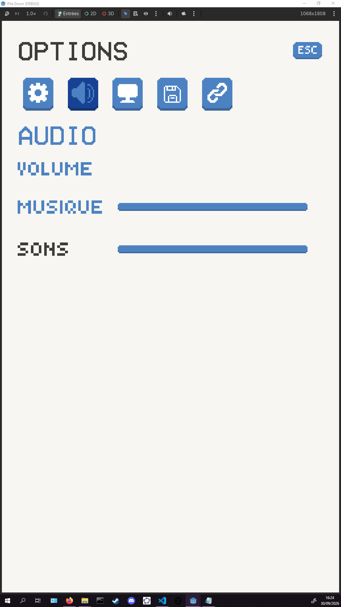
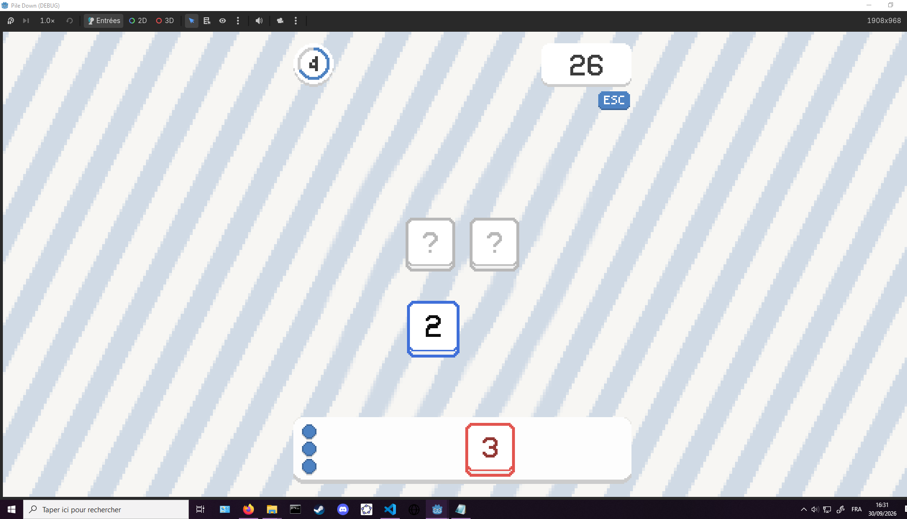

Consigne permanente : à chaque utilisation de ce fichier, suivre les demandes avec des cases `- [ ]` et les cocher `- [x]` dès que leur implémentation est terminée et vérifiée. Laisser décochée toute demande incomplète ou non vérifiée et conserver ce suivi dans le fichier, sans attendre un rappel.

- 
lorsque l'on ouvre sur un sous menu avec un text selectionnable il est toujours automatiqument selectionné

-
les nombre sur les tuiles perde leur couleurs lorsqu'ils sont grab opu discard